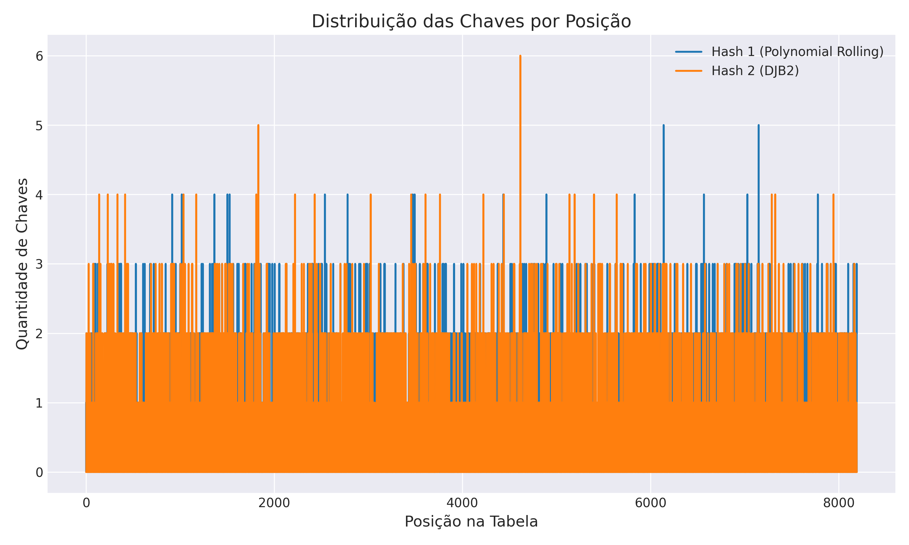
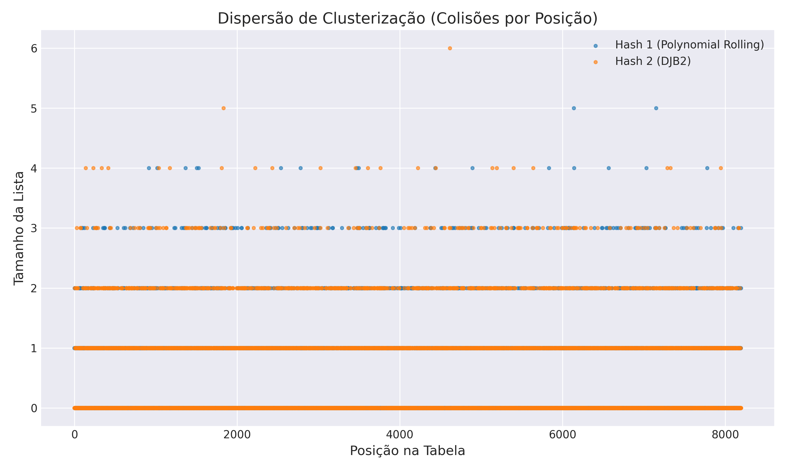
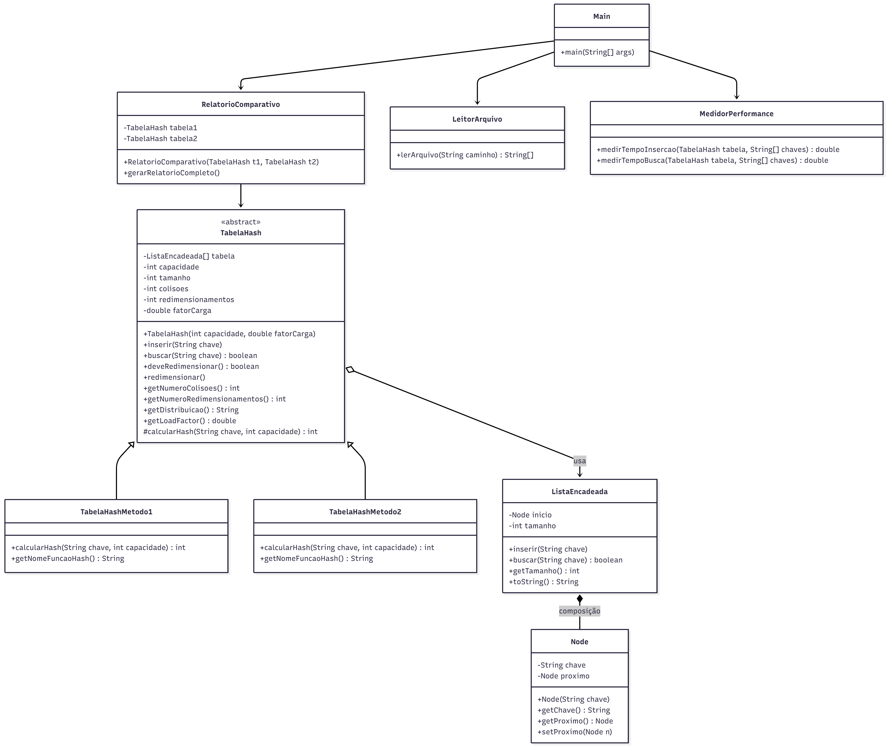

# 🧠 Implementação de Tabelas Hash em Java

**Disciplina:** Resolução de Problemas Estruturados em Computação  
**Curso:** Bacharelado em Sistemas de Informação — PUCPR  
**Professora:** Marina de Lara  
**Autores:**
- **Fernando Alonso Piroga da Silva** – Implementação da Função Hash 1 (Polynomial Rolling Hash)
- **Jafte Carneiro Fagundes da Silva** – Coordenação, Estrutura Base, Testes, Diagramas, Relatórios e Main  
- **Renato Pestana de Gouveia** – Implementação da Função Hash 2 (DJB2)

---

## 📘 1. Introdução

Este projeto acadêmico tem como objetivo **comparar a eficiência de duas funções hash** distintas, implementadas de forma **100% manual em Java**, **sem o uso de estruturas de dados prontas** da linguagem (como `ArrayList`, `LinkedList`, `HashMap`, etc.).

A aplicação foi construída sob os princípios da **Programação Orientada a Objetos (POO)**, aplicando **abstração, encapsulamento, herança e polimorfismo** para criar uma arquitetura modular, testável e extensível.

---

## 🧩 2. Estrutura do Projeto

```

projeto-hash/
├── data/
│   └── female_names.txt          # Arquivo de entrada com 5000 nomes
├── src/
│   ├── Main.java                 # Classe principal (menu, execução e relatório)
│   ├── Node.java                 # Nó da lista encadeada
│   ├── ListaEncadeada.java       # Implementação manual do encadeamento
│   ├── TabelaHash.java           # Classe abstrata (base comum)
│   ├── TabelaHashMetodo1.java    # Implementação de Fernando
│   ├── TabelaHashMetodo2.java    # Implementação de Renato
│   ├── LeitorArquivo.java        # Utilitário para leitura de arquivo
│   ├── MedidorPerformance.java   # Cronometragem de inserções/buscas
│   └── RelatorioComparativo.java # Relatório final comparativo
└── README.md

```

---

## ⚙️ 3. Configuração do Projeto

### Requisitos
- **Java JDK 17** ou superior
- Terminal de execução (CLI)
- Arquivo `female_names.txt` contendo uma lista de nomes (mínimo 1000 registros)

### Compilação e Execução

No terminal (a partir da raiz do projeto):

```bash
# Compilar todos os arquivos
javac src/*.java -d bin

# Executar o programa
java -cp bin Main
````

---

## 🧠 4. Descrição das Classes

### 🏗️ **Node.java**

Estrutura base de um nó para lista encadeada, contendo:

* `String chave`
* Ponteiro `Node proximo`

Usada para armazenar as chaves (nomes) e lidar com colisões.

---

### 🔗 **ListaEncadeada.java**

Implementação **manual** de uma lista encadeada simples:

* Métodos: `inserir(String)`, `buscar(String)`, `getTamanho()`
* Sem uso de `LinkedList` do Java
* Base para o **encadeamento (chaining)** da Tabela Hash

---

### 🧮 **TabelaHash.java (Abstrata)**

Classe **abstrata e polimórfica**, responsável por:

* Armazenar o vetor principal de **listas encadeadas**
* Controlar métricas: colisões, redimensionamentos, fator de carga
* Métodos:

    * `inserir(String chave)`
    * `buscar(String chave)`
    * `redimensionar()`
    * `getNumeroColisoes()`
    * `getNumeroRedimensionamentos()`
    * `getLoadFactor()`
    * `mostrarDistribuicao()`
* Método **abstrato** `calcularHash(String chave, int capacidade)` — sobrescrito nas subclasses

---

### ⚡ **TabelaHashMetodo1.java**

Implementa o **Método Polynomial Rolling Hash**, uma função de complexidade média amplamente usada em algoritmos de comparação de strings.  
Essa técnica calcula o hash combinando o valor ASCII de cada caractere multiplicado por uma constante base, com operação modular pela capacidade da tabela.

```java
@Override
protected int calcularHash(String chave, int capacidade) {
    long hash = 0;
    int p = 31; // base polinomial
    for (int i = 0; i < chave.length(); i++) {
        hash = (hash * p + chave.charAt(i)) % capacidade;
    }
    return (int) Math.abs(hash);
}
```

---

### 🔥 **TabelaHashMetodo2.java**

Implementa o **algoritmo DJB2**, criado por **Daniel J. Bernstein**.  
É um dos métodos de hashing mais conhecidos pela simplicidade e excelente dispersão de bits.  
A função inicia com um valor base (`5381`) e, para cada caractere da string, multiplica o hash acumulado por 33 e soma o código ASCII do caractere.

```java
@Override
protected int calcularHash(String chave, int capacidade) {
    long hash = 5381;
    for (int i = 0; i < chave.length(); i++) {
        hash = ((hash << 5) + hash) + chave.charAt(i); // hash * 33 + c
    }
    return (int) (Math.abs(hash) % capacidade);
}
```

#### 📊 Resultados e Análises

| Função Hash | Colisões | Redimensionamentos | Tempo Inserção (ms) | Tempo Busca (ms) | Fator de Carga |
| --------- | -------- | ------------------ | ------------------- | ---------------- | -------------- |
| Polynomial Rolling | 2020     | 8                  | 12.014              | 0.107            | 0.61           |
| DJB2      | 2007     | 8                  | 10.412              | 0.065            | 0.61           |

  
*Figura 1 – Distribuição das Chaves por Posição.*

  
*Figura 2 – Clusterização das Colisões por Posição.*

---


### 📚 **LeitorArquivo.java**

Leitura manual de arquivo `.txt`:

* Usa `BufferedReader`
* Armazena os nomes em um vetor fixo (`String[]`)
* Não utiliza `ArrayList` ou coleções

---

### ⏱️ **MedidorPerformance.java**

Classe auxiliar para medir tempos de execução:

* `medirTempoInsercao(TabelaHash tabela, String[] chaves)`
* `medirTempoBusca(TabelaHash tabela, String[] chaves)`

Retorna o tempo em **milissegundos**.

---

### 📊 **RelatorioComparativo.java**

Gera o **relatório textual completo** com:

* Totais de colisões
* Redimensionamentos
* Tempo de inserção e busca
* Fator de carga final
* Conclusão comparativa automática

Exemplo de saída:

```ascii
============================================================
    COMPARAÇÃO DE FUNÇÕES HASH - RA03 (PUCPR)
============================================================
CONFIGURAÇÃO:
  - Capacidade inicial: 32
  - Fator de carga: 0.75
  - Total de nomes inseridos: 5001
  - Método de colisão: Encadeamento (Lista Encadeada manual)

============================================================
RESULTADOS - TABELA HASH 1 (Método 1: Polynomial Rolling Hash)
============================================================
  Total de colisões: 2020
  Redimensionamentos: 8
  Tempo de inserção: 13,976 ms
  Tempo de busca: 0,065 ms
  Fator de carga final: 0,61

============================================================
RESULTADOS - TABELA HASH 2 (Método 2: DJB2 (Daniel J. Bernstein))
============================================================
  Total de colisões: 2007
  Redimensionamentos: 8
  Tempo de inserção: 10,412 ms
  Tempo de busca: 0,059 ms
  Fator de carga final: 0,61

============================================================
DISTRIBUIÇÃO DAS CHAVES (primeiras 64 posições)
============================================================
Pos   | Hash1  | Hash2  | Método 1: Polynomial Rolling Hash | Método 2: DJB2 (Daniel J. Bernstein)
--------------------------------------------------------------------------
0     | 1      | 0      | █                        |                         
1     | 1      | 0      | █                        |                         
2     | 0      | 0      |                          |                         
3     | 2      | 0      | ██                       |                         
4     | 2      | 2      | ██                       | ██                      
5     | 0      | 0      |                          |                         
6     | 0      | 0      |                          |                         
7     | 1      | 1      | █                        | █                       
8     | 0      | 0      |                          |                         
9     | 0      | 1      |                          | █                       
10    | 0      | 1      |                          | █                       
11    | 1      | 0      | █                        |                         
12    | 1      | 0      | █                        |                         
13    | 0      | 0      |                          |                         
14    | 0      | 0      |                          |                         
15    | 0      | 1      |                          | █                       
16    | 0      | 1      |                          | █                       
17    | 1      | 0      | █                        |                         
18    | 0      | 0      |                          |                         
19    | 0      | 1      |                          | █                       
20    | 1      | 2      | █                        | ██                      
21    | 1      | 0      | █                        |                         
22    | 0      | 1      |                          | █                       
23    | 0      | 0      |                          |                         
24    | 0      | 2      |                          | ██                      
25    | 0      | 0      |                          |                         
26    | 0      | 0      |                          |                         
27    | 1      | 1      | █                        | █                       
28    | 0      | 3      |                          | ███                     
29    | 0      | 0      |                          |                         
30    | 0      | 1      |                          | █                       
31    | 0      | 0      |                          |                         
32    | 0      | 0      |                          |                         
33    | 1      | 0      | █                        |                         
34    | 1      | 0      | █                        |                         
35    | 0      | 0      |                          |                         
36    | 0      | 2      |                          | ██                      
37    | 0      | 0      |                          |                         
38    | 1      | 0      | █                        |                         
39    | 0      | 0      |                          |                         
40    | 0      | 1      |                          | █                       
41    | 0      | 0      |                          |                         
42    | 1      | 0      | █                        |                         
43    | 0      | 0      |                          |                         
44    | 1      | 1      | █                        | █                       
45    | 0      | 0      |                          |                         
46    | 0      | 2      |                          | ██                      
47    | 0      | 0      |                          |                         
48    | 0      | 0      |                          |                         
49    | 1      | 0      | █                        |                         
50    | 0      | 1      |                          | █                       
51    | 0      | 1      |                          | █                       
52    | 0      | 0      |                          |                         
53    | 2      | 1      | ██                       | █                       
54    | 0      | 0      |                          |                         
55    | 0      | 1      |                          | █                       
56    | 1      | 0      | █                        |                         
57    | 1      | 0      | █                        |                         
58    | 0      | 0      |                          |                         
59    | 0      | 0      |                          |                         
60    | 1      | 0      | █                        |                         
61    | 0      | 0      |                          |                         
62    | 0      | 1      |                          | █                       
63    | 2      | 0      | ██                       |                         

============================================================
ANÁLISE DE CLUSTERIZAÇÃO (Top 10 posições mais congestionadas)
============================================================
Método 1: Polynomial Rolling Hash:
  Posição 6138: 4 colisões
  Posição 7148: 4 colisões
  Posição 915: 3 colisões
  Posição 1017: 3 colisões
  Posição 1364: 3 colisões
  Posição 1502: 3 colisões
  Posição 1526: 3 colisões
  Posição 2538: 3 colisões
  Posição 2779: 3 colisões
  Posição 3472: 3 colisões
Método 2: DJB2 (Daniel J. Bernstein):
  Posição 4615: 5 colisões
  Posição 1831: 4 colisões
  Posição 139: 3 colisões
  Posição 231: 3 colisões
  Posição 334: 3 colisões
  Posição 415: 3 colisões
  Posição 1036: 3 colisões
  Posição 1171: 3 colisões
  Posição 1809: 3 colisões
  Posição 2221: 3 colisões

============================================================
CONCLUSÃO COMPARATIVA
============================================================
✓ MENOS colisões: Método 2: DJB2 (Daniel J. Bernstein)
✓ MENOS redimensionamentos: Método 1: Polynomial Rolling Hash

```

### 📊 **Diagrama de Classes**

  
*Figura 3 – Diagrama de Classes do Sistema.*

---

## 🧩 5. Conceitos Aplicados de POO

| Conceito                   | Aplicação no Projeto                                             |
| -------------------------- | ---------------------------------------------------------------- |
| **Encapsulamento**         | Todos os atributos são privados e acessados via métodos públicos |
| **Abstração**              | `TabelaHash` define a estrutura comum de todas as tabelas        |
| **Herança**                | `TabelaHashMetodo1` e `TabelaHashMetodo2` herdam de `TabelaHash` |
| **Polimorfismo**           | O método `calcularHash()` é sobrescrito em cada implementação    |
| **Composição**             | A Tabela Hash contém listas encadeadas compostas por `Node`      |
| **Tratamento de exceções** | Leitura de arquivo e redimensionamento com verificações seguras  |

---

## 🧮 6. Funcionamento Interno

### 🔹 Inserção

1. Calcula o índice da chave com `calcularHash()`
2. Verifica se já existe na lista encadeada
3. Insere no final da lista
4. Incrementa contadores e verifica **fator de carga**
5. Se necessário, chama `redimensionar()`

### 🔹 Colisão

* Implementada via **encadeamento**
* Cada posição da tabela contém uma **ListaEncadeada** manual

### 🔹 Redimensionamento

* Ocorre quando `tamanho / capacidade ≥ fatorCarga`
* Dobra a capacidade (`capacidade * 2`)
* Reinsere **todos os elementos (rehashing)**

---

## 📈 7. Métricas de Eficiência

Durante a execução, o programa mede:

| Métrica                  | Descrição                                        |
| ------------------------ | ------------------------------------------------ |
| **Colisões**             | Quantas inserções caíram em posições já ocupadas |
| **Redimensionamentos**   | Quantas vezes a tabela dobrou de tamanho         |
| **Tempo de Inserção**    | Tempo total para inserir todos os nomes          |
| **Tempo de Busca**       | Tempo para buscar 100 nomes aleatórios           |
| **Fator de Carga Final** | `tamanho / capacidade` após todas as inserções   |
| **Distribuição**         | Quantidade de chaves por posição da tabela       |

---

## 🧪 8. Testes e Validação

Os testes consistem em:

1. Inserir 5000 nomes na Tabela Hash 1 e 2.
2. Medir:

    * Colisões
    * Redimensionamentos
    * Tempo de inserção
3. Buscar 100 nomes aleatórios.
4. Gerar relatório final automático.

---

## 🧠 09. Conclusões e Aprendizados

O projeto proporcionou uma visão profunda sobre:

* Implementação interna de tabelas hash
* Cálculo e impacto das funções hash
* Importância da escolha do método de dispersão
* Diferença entre eficiência de hash functions
* Aplicação de **POO em estruturas de dados reais**

Além disso, o exercício reforça a importância de:

* **Projetar hierarquias de classes reutilizáveis**
* **Reduzir acoplamento entre componentes**
* **Garantir modularidade e extensibilidade**

---

## 🏁 10. Licença

Este projeto foi desenvolvido exclusivamente para fins acadêmicos na PUCPR.
É proibida a reprodução total ou parcial sem autorização dos autores.

---

> **“Entender como construir uma estrutura de dados é mais valioso do que apenas usá-la.”**
> — Donald Knuth
